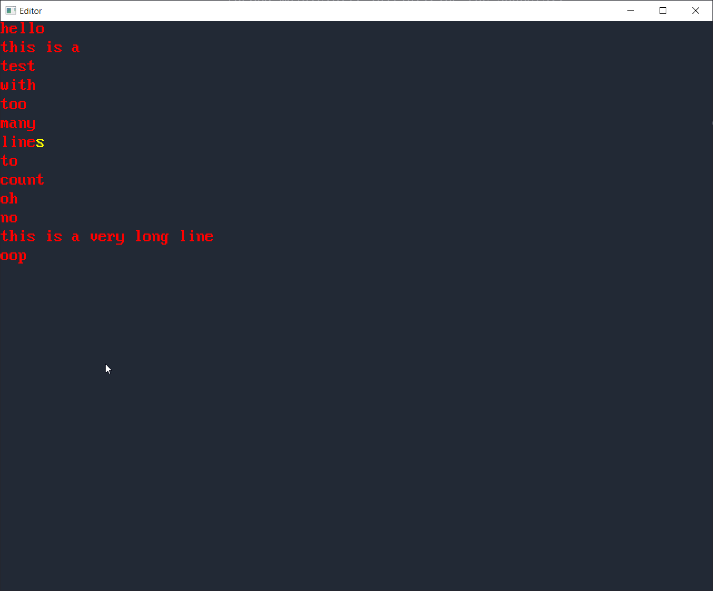

# Editor

This is a simple text editor, it only supports ASCII and some very rudimentary operations.
It is implemented on top of OpenGL and the Freetype library (for rendering characters).

The goal of this (weekend) project was to explore OpenGL and figure out a simple way to get characters on the screen.

 

Features:

- Open a file (given through the command line arguments)
- Basic cursor movement (w/ blinking!)
- Basic editing (e.g. changing numbers/letters, deleting characters, create newlines)
- Saving the changes to the same file
- Basic settings (windowed, fullscreen, font, font size, etc)

 

